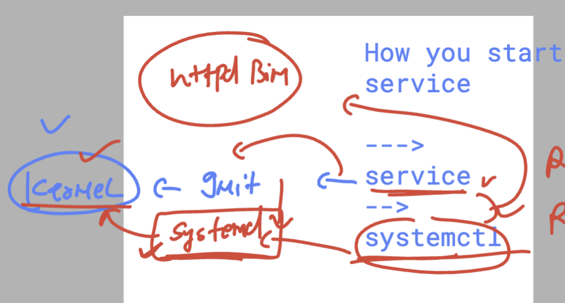

# linux_kernel_siemens_27thOct2025

### linux kernel info 


### Interfaces in Linux kernel options 


### How to connect a remote linux machine 


### connect linux remote host using ssh command 

```
humanfirmware@darwin  ~  ssh  test@13.204.188.206     
test@13.204.188.206's password: 
Register this system with Red Hat Insights: rhc connect

```

### user ID concepts with all kind of users in linux kernel 


### basic commands 

```
[test@ip-172-31-43-251 ~]$ pwd
/home/test
[test@ip-172-31-43-251 ~]$ mkdir  hello
[test@ip-172-31-43-251 ~]$ ls
hello
[test@ip-172-31-43-251 ~]$ rmdir  hello
[test@ip-172-31-43-251 ~]$ mkdir  hello{1..10}
[test@ip-172-31-43-251 ~]$ ls
hello1  hello10  hello2  hello3  hello4  hello5  hello6  hello7  hello8  hello9
[test@ip-172-31-43-251 ~]$ rmdir  hello{1..10}
[test@ip-172-31-43-251 ~]$ mkdir  hi ashu hello 
[test@ip-172-31-43-251 ~]$ ls
ashu  hello  hi
[test@ip-172-31-43-251 ~]$ rmdir  hi ashu hello 
[test@ip-172-31-43-251 ~]$ 

```

### tips

```
[test@ip-172-31-43-251 ~]$ x=10
[test@ip-172-31-43-251 ~]$ 
[test@ip-172-31-43-251 ~]$ echo x
x
[test@ip-172-31-43-251 ~]$ echo $x
10
[test@ip-172-31-43-251 ~]$ for i  in   ashu oke name   
> do
> mkdir  $i 
> done
[test@ip-172-31-43-251 ~]$ ls
ashu  name  oke
[test@ip-172-31-43-251 ~]$ for i  in   ashu oke name   ; do rmdir   $i ; done
[test@ip-172-31-43-251 ~]$ 

```

### more basic kernel and os related commands 

```
[ec2-user@ip-172-31-43-251 ~]$ uname 
Linux
[ec2-user@ip-172-31-43-251 ~]$ uname -r
5.14.0-570.22.1.el9_6.x86_64


[ec2-user@ip-172-31-43-251 ~]$ 
[ec2-user@ip-172-31-43-251 ~]$ 
[ec2-user@ip-172-31-43-251 ~]$ 
[ec2-user@ip-172-31-43-251 ~]$ host
hostid       hostname     hostnamectl  
[ec2-user@ip-172-31-43-251 ~]$ hostname
hostname     hostnamectl  


[ec2-user@ip-172-31-43-251 ~]$ hostnamectl 
 Static hostname: ip-172-31-43-251.ap-south-1.compute.internal
       Icon name: computer-vm
         Chassis: vm 🖴
      Machine ID: 1298f4adc3574559a95b357877b7d476
         Boot ID: 5110cd1c24e0499b8338ff24c6961c92
  Virtualization: xen
Operating System: Red Hat Enterprise Linux 9.6 (Plow)         
     CPE OS Name: cpe:/o:redhat:enterprise_linux:9::baseos
          Kernel: Linux 5.14.0-570.22.1.el9_6.x86_64
    Architecture: x86-64
 Hardware Vendor: Xen
  Hardware Model: HVM domU
Firmware Version: 4.11.amazon
[ec2-user@ip-172-31-43-251 ~]$ cat  /etc/os-release 
NAME="Red Hat Enterprise Linux"
VERSION="9.6 (Plow)"
ID="rhel"
ID_LIKE="fedora"
VERSION_ID="9.6"
PLATFORM_ID="platform:el9"
PRETTY_NAME="Red Hat Enterprise Linux 9.6 (Plow)"
ANSI_COLOR="0;31"
LOGO="fedora-logo-icon"
CPE_NAME="cpe:/o:redhat:enterprise_linux:9::baseos"
HOME_URL="https://www.redhat.com/"
DOCUMENTATION_URL="https://access.redhat.com/documentation/en-us/red_hat_enterprise_linux/9"
BUG_REPORT_URL="https://issues.redhat.com/"

REDHAT_BUGZILLA_PRODUCT="Red Hat Enterprise Linux 9"
REDHAT_BUGZILLA_PRODUCT_VERSION=9.6
REDHAT_SUPPORT_PRODUCT="Red Hat Enterprise Linux"
REDHAT_SUPPORT_PRODUCT_VERSION="9.6"
[ec2-user@ip-172-31-43-251 ~]$ 


```


### file editors in linux kernel 


### some info about  vim editor shortcuts 


### directory for logs purpose 

```
 17  cd  /var/
   18  ls
   19  cd log
   20  ls
   21  ls  -l 
   22  ls
   23  cat  secure 
   24  sudo cat  secure 
   25  pwd
   26  ls
   27  cat messages 
   28  sudo cat messages 
   29  ls
   30  sudo cat messages 
   31  sudo tail   secure 
   32  sudo tail  -f   secure 
   33  sudo tail    secure 
   34  sudo tail  -20   secure 
   35  sudo tail  -f   secure 

```
### logs for apache httpd 

```
  19  ls /var/log/
   20  ls /var/log/httpd/
   21  vim  /var/www/html/index.html
   22  systemctl start httpd
   23  ls /var/log/httpd/
   24  cat /var/log/httpd/access_log 
   25  cat /var/log/httpd/error_log 

```

### more info 

```
[test@ip-172-31-43-251 log]$ sudo -i 
[root@ip-172-31-43-251 ~]# 
[root@ip-172-31-43-251 ~]# 
[root@ip-172-31-43-251 ~]# whoami 
root
[root@ip-172-31-43-251 ~]# 
[root@ip-172-31-43-251 ~]# cd /var/log/
[root@ip-172-31-43-251 log]# ls
audit            chrony                 cron             dnf.rpm.log  insights-client  messages  rhsm    spooler   tuned
btmp             cloud-init.log         dnf.librepo.log  hawkey.log   lastlog          private   rhui    sssd      wtmp
choose_repo.log  cloud-init-output.log  dnf.log          httpd        maillog          README    secure  tallylog
[root@ip-172-31-43-251 log]# cd httpd/
[root@ip-172-31-43-251 httpd]# ls
access_log  error_log
[root@ip-172-31-43-251 httpd]# 
[root@ip-172-31-43-251 httpd]# 
[root@ip-172-31-43-251 httpd]# exit
logout

```
### Deploy / host fronted UI application 

### Installing httpd on rhel 9 

```
sudo dnf install httpd 

```

### verify log location 

```
sudo ls /var/log/
audit		 chrony			cron		 dnf.rpm.log  insights-client  messages  rhsm	 spooler   tuned
btmp		 cloud-init.log		dnf.librepo.log  hawkey.log   lastlog	       private	 rhui	 sssd	   wtmp
choose_repo.log  cloud-init-output.log	dnf.log		 httpd	      maillog	       README	 secure  tallylog
[ec2-user@ip-172-31-43-251 ~]$ sudo ls /var/log/httpd/
access_log  error_log
[ec2-user@ip-172-31-43-251 ~]$ 

```

### navigating to httpd.conf file 

```
[ec2-user@ip-172-31-43-251 ~]$ cd  /etc/httpd/
[ec2-user@ip-172-31-43-251 httpd]$ ls
conf  conf.d  conf.modules.d  logs  modules  run  state
[ec2-user@ip-172-31-43-251 httpd]$ 
[ec2-user@ip-172-31-43-251 httpd]$ 
[ec2-user@ip-172-31-43-251 httpd]$ cd  conf.d/
[ec2-user@ip-172-31-43-251 conf.d]$ ls
autoindex.conf  README  userdir.conf  welcome.conf
[ec2-user@ip-172-31-43-251 conf.d]$ cd  .. 
[ec2-user@ip-172-31-43-251 httpd]$ ls
conf  conf.d  conf.modules.d  logs  modules  run  state
[ec2-user@ip-172-31-43-251 httpd]$ cd  conf
[ec2-user@ip-172-31-43-251 conf]$ ls
httpd.conf  magic
[ec2-user@ip-172-31-43-251 conf]$ 


```

### sample html code webapp 

```
https://github.com/schoolofdevops/html-sample-app.git

```

### to download git code 

```
sudo dnf install git -y 
cd /tmp
git clone  https://github.com/schoolofdevops/html-sample-app.git

 ls
ar
html-sample-app
systemd-private-5110cd1c24e0499b8338ff24c6

```

### copy code 

```
sudo cp -rf  html-sample-app/*  /var/www/html/
[ec2-user@ip-172-31-43-251 tmp]$ 
[ec2-user@ip-172-31-43-251 tmp]$ 
[ec2-user@ip-172-31-43-251 tmp]$ ls /var/www/html/
assets  elements.html  generic.html  html5up-phantom.zip  images  index.html  LICENSE.txt  README.txt
[ec2-user@ip-172-31-43-251 tmp]$ 

```
### some basic details about apache httpd 


### starting serviced 

```
[ec2-user@ip-172-31-43-251 tmp]$ sudo systemctl start httpd 
[ec2-user@ip-172-31-43-251 tmp]$ sudo systemctl status  httpd 
● httpd.service - The Apache HTTP Server
     Loaded: loaded (/usr/lib/systemd/system/httpd.service; disabled; preset: disabled)
     Active: active (running) since Mon 2025-10-27 07:08:43 UTC; 2h 10min ago
       Docs: man:httpd.service(8)
   Main PID: 25533 (httpd)
     Status: "Total requests: 174; Idle/Busy workers 100/0;Requests/sec: 0.0223; Bytes served/sec:  71 B/sec"
      Tasks: 177 (limit: 48572)
     Memory: 25.8M
        CPU: 4.124s
     CGroup: /system.slice/httpd.service
             ├─25533 /usr/sbin/httpd -DFOREGROUND
             ├─25534 /usr/sbin/httpd -DFOREGROUND
             ├─25535 /usr/sbin/httpd -DFOREGROUND
             ├─25536 /usr/sbin/httpd -DFOREGROUND
             └─25537 /usr/sbin/httpd -DFOREGROUND


```
### service vs systemctl 



### enable / disable any service after reboot 

```
[ec2-user@ip-172-31-43-251 tmp]$ sudo systemctl enable   httpd 
Created symlink /etc/systemd/system/multi-user.target.wants/httpd.service → /usr/lib/systemd/system/httpd.service.
[ec2-user@ip-172-31-43-251 tmp]$ 
[ec2-user@ip-172-31-43-251 tmp]$ 
[ec2-user@ip-172-31-43-251 tmp]$ sudo systemctl disable  httpd 
Removed "/etc/systemd/system/multi-user.target.wants/httpd.service".
[ec2-user@ip-172-31-43-251 tmp]$ 
[ec2-user@ip-172-31-43-251 tmp]$ 


```
### info about the process 

```
 165  cd /proc/
  166  ls
  167  id
  168  mkdir  hello
  169  cd 29222/
  170  pwd
  171  ls
  172  ls ns
  173  pidof  httpd
  174  cd
  175  top 
  176  ps 
  177  ps   -e  
  178  ps   -aux   

```