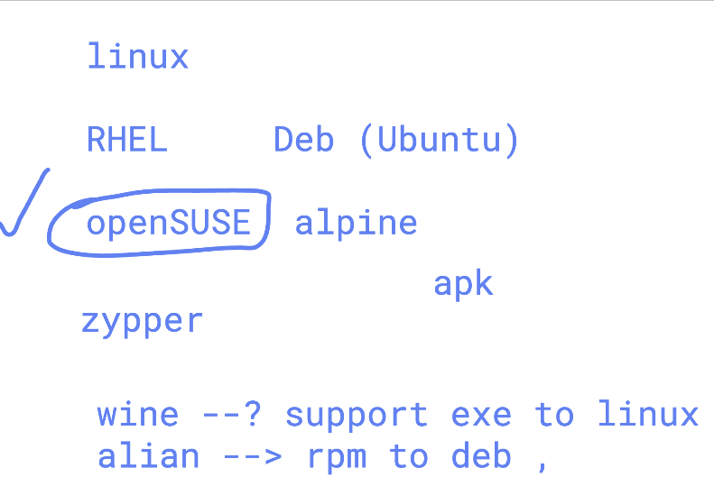
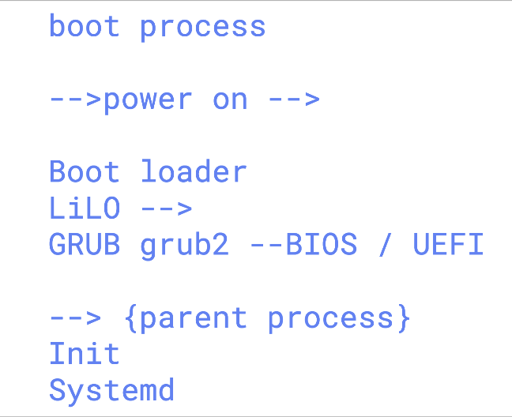

# linux_kernel_siemens_27thOct2025

### more info about os support 



### systemd as parent process of Linux based OS 

```
 pstree
systemd─┬─NetworkManager───2*[{NetworkManager}]
        ├─2*[agetty]
        ├─auditd─┬─sedispatch
        │        └─2*[{auditd}]
        ├─chronyd
        ├─crond
        ├─dbus-broker-lau───dbus-broker
        ├─irqbalance───{irqbalance}
        ├─polkitd───5*[{polkitd}]
        ├─rhsmcertd───{rhsmcertd}
        ├─rsyslogd───2*[{rsyslogd}]
        ├─sshd─┬─sshd───sshd───bash
        │      └─sshd───sshd───bash───sudo───bash───pstree
        ├─systemd───(sd-pam)
        ├─systemd-journal
        ├─systemd-logind
        ├─systemd-udevd
        └─tuned───3*[{tuned}]

```

### bootloader info 



