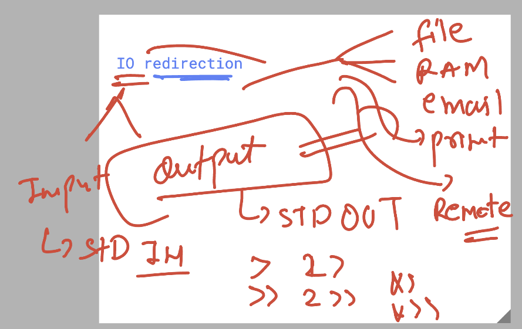
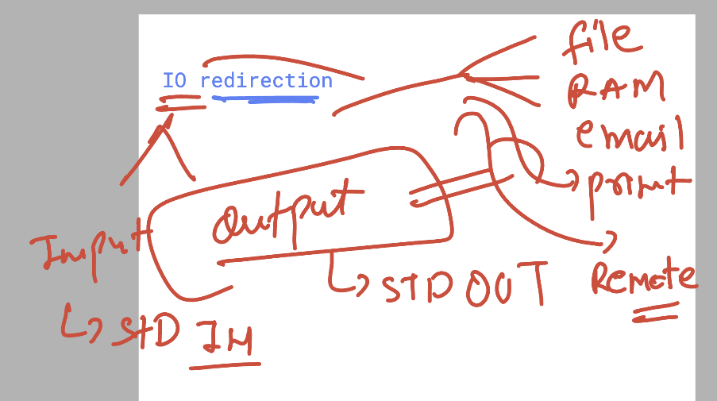
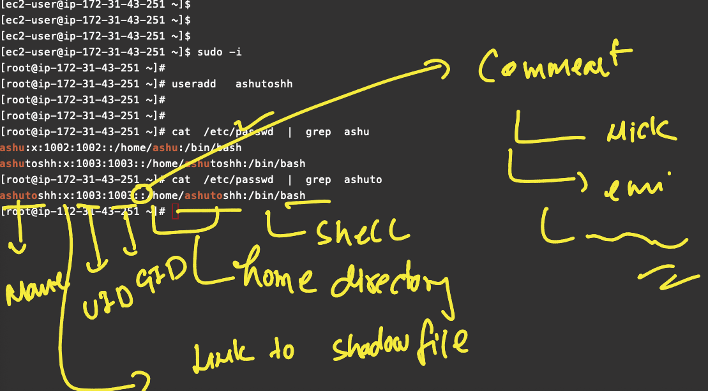
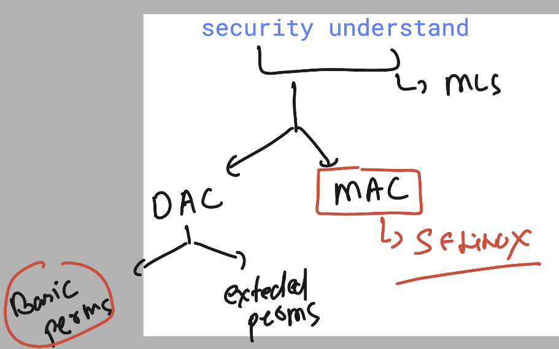

# linux_kernel_siemens_27thOct2025

### more info about os support 


### systemd as parent process of Linux based OS 

```
 pstree
systemd─┬─NetworkManager───2*[{NetworkManager}]
        ├─2*[agetty]
        ├─auditd─┬─sedispatch
        │        └─2*[{auditd}]
        ├─chronyd
        ├─crond
        ├─dbus-broker-lau───dbus-broker
        ├─irqbalance───{irqbalance}
        ├─polkitd───5*[{polkitd}]
        ├─rhsmcertd───{rhsmcertd}
        ├─rsyslogd───2*[{rsyslogd}]
        ├─sshd─┬─sshd───sshd───bash
        │      └─sshd───sshd───bash───sudo───bash───pstree
        ├─systemd───(sd-pam)
        ├─systemd-journal
        ├─systemd-logind
        ├─systemd-udevd
        └─tuned───3*[{tuned}]

```

### bootloader info 


## Understanding Shell in LInux 


### info about shell 


### shell avaialble shells 

```
 
[ec2-user@ip-172-31-43-251 ~]$ cat  /etc/shells 
/bin/sh
/bin/bash
/usr/bin/sh
/usr/bin/bash
[ec2-user@ip-172-31-43-251 ~]$ 


```

### checking current shell of user 

```
 echo $SHELL 
/bin/bash
[ec2-user@ip-172-31-43-251 ~]$ 

127  echo $SHELL 
  128  echo $HOME 
  129  echo $LANG
  130  echo $HISTSIZE
  131  echo $HISTFILE


```

### .bashrc and .bash_profile file 


### using source command to load .bashrc file 

```
[ec2-user@ip-172-31-43-251 ~]$ vim  .bashrc 
[ec2-user@ip-172-31-43-251 ~]$ 
[ec2-user@ip-172-31-43-251 ~]$ echo $HISTFILE
/home/ec2-user/.bash_history
[ec2-user@ip-172-31-43-251 ~]$ echo $HISTSIZE
1000
[ec2-user@ip-172-31-43-251 ~]$ source  ~/.bashrc 
[ec2-user@ip-172-31-43-251 ~]$ echo $HISTSIZE
20000
[ec2-user@ip-172-31-43-251 ~]$ echo $HISTFILE
/home/ec2-user/.ashu_data_history.txt

```

### setting variable with and without export 

## Note with export all the child process can access it 

```
[ec2-user@ip-172-31-43-251 ~]$ z=200
[ec2-user@ip-172-31-43-251 ~]$ 
[ec2-user@ip-172-31-43-251 ~]$ ps
    PID TTY          TIME CMD
   3423 pts/7    00:00:00 bash
   3733 pts/7    00:00:00 ps
[ec2-user@ip-172-31-43-251 ~]$ bash -c "echo $z"
200
[ec2-user@ip-172-31-43-251 ~]$ python
Python 3.9.21 (main, Feb 10 2025, 00:00:00) 
[GCC 11.5.0 20240719 (Red Hat 11.5.0-5)] on linux
Type "help", "copyright", "credits" or "license" for more information.
>>> import os
>>> print(os.getenv("z"))
None
>>> 
[ec2-user@ip-172-31-43-251 ~]$ export z=300
[ec2-user@ip-172-31-43-251 ~]$ bash -c "echo $z"
300
[ec2-user@ip-172-31-43-251 ~]$ 
[ec2-user@ip-172-31-43-251 ~]$ python
Python 3.9.21 (main, Feb 10 2025, 00:00:00) 
[GCC 11.5.0 20240719 (Red Hat 11.5.0-5)] on linux
Type "help", "copyright", "credits" or "license" for more information.
>>> import os
>>> print(os.getenv("z"))
300
>>> 

```

### system level env 

```
root@ip-172-31-43-251 ~]# cd /etc/profile.d/
[root@ip-172-31-43-251 profile.d]# ls
bash_completion.sh  colorls.csh      colorxzgrep.sh  csh.local       gawk.csh  lang.sh   sh.local
colorgrep.csh       colorls.sh       colorzgrep.csh  debuginfod.csh  gawk.sh   less.csh  which2.csh
colorgrep.sh        colorxzgrep.csh  colorzgrep.sh   debuginfod.sh   lang.csh  less.sh   which2.sh
[root@ip-172-31-43-251 profile.d]# 
[root@ip-172-31-43-251 profile.d]# 
[root@ip-172-31-43-251 profile.d]# cat  /etc/environment 
[root@ip-172-31-43-251 profile.d]# 
[root@ip-172-31-43-251 profile.d]# vim  /etc/environment 
[root@ip-172-31-43-251 profile.d]# source /etc/environment 
[root@ip-172-31-43-251 profile.d]# cat /etc/environment 
d=20900
[root@ip-172-31-43-251 profile.d]# vim /etc/profile
[root@ip-172-31-43-251 profile.d]# 


```

## to run shell script 

### method 1 

```
bash  ashu.sh 

```

### method 2 

```
chmod +x ashu.sh
./ashu.sh 

```

### IO redirection 



### storage based redirection 




### some more commands 

```
132  cat /etc/passwd  |  head -4   | tail -1
  133  cp -v  /etc/passwd  . 
  134  cat  passwd 
  135  ls
  136  cat  a.txt 
  137  tac  a.txt 
  138  cat  passwd  
  139  cat  passwd    |  cut  -d:  -f1
  140  vim  ~/.bashrc 
  141  source ~/.bashrc 
  142  allusers 
  143  history 
  144  cat  passwd    |  cut  -d:  -f1,3  
  145  cat  passwd    |  cut  -d:  -f1,7  
  146  cat  passwd    | awk  -F: "print  $1" 
  147  cat  passwd    | awk  -F: "$1" 
  148  cat  passwd    | awk  -F: $1
  149  cat  passwd    | awk  -F: '{print  $1}'  
  150  cat  passwd    | awk  -F: '{print  $1 and $7 }'  
  151  cat  passwd    | awk  -F: '{print  $1 " " $7 }'  
  152  cat  passwd    | awk  -F: '{print  $1 "___" $7 }'  
  153  cat  passwd    | awk  -F: '{print  $1 " " $7 }'  
  154  history 


```


### info about useradd 



### passwd command 

```
root@ip-172-31-43-251 ~]# grep ashut  /etc/shadow
ashutoshh:$6$rounds=100000$9lO1GkexOY0vqiAX$85SijklO4JGLej9NW5rMRaI0vGf8UhnXicgsgBb182Xd9QOcxcQ1l4SEG/SqQtTEAv97huv012vrmWbWKx8TI1:20389:0:99999:7:::
[root@ip-172-31-43-251 ~]# 
[root@ip-172-31-43-251 ~]# 
[root@ip-172-31-43-251 ~]# passwd  -d ashutoshh
Removing password for user ashutoshh.
passwd: Success
[root@ip-172-31-43-251 ~]# 
[root@ip-172-31-43-251 ~]# grep ashut  /etc/shadow
ashutoshh::20389:0:99999:7:::
[root@ip-172-31-43-251 ~]# passwd  -l ashutoshh
Locking password for user ashutoshh.
passwd: Success
[root@ip-172-31-43-251 ~]# grep ashut  /etc/shadow
ashutoshh:!!:20389:0:99999:7:::
[root@ip-172-31-43-251 ~]# 

```
### user deletion 

```
[root@ip-172-31-43-251 ~]# userdel   ashutoshh 
[root@ip-172-31-43-251 ~]# 
[root@ip-172-31-43-251 ~]# 
[root@ip-172-31-43-251 ~]# ls /home/
ashu  ashutoshh  ec2-user  t1  test
[root@ip-172-31-43-251 ~]# 
[root@ip-172-31-43-251 ~]# 
[root@ip-172-31-43-251 ~]# ls /var/spool/mail/
ashu  ashutoshh  ec2-user  t1  test
[root@ip-172-31-43-251 ~]# 
[root@ip-172-31-43-251 ~]# 
[root@ip-172-31-43-251 ~]# userdel  -r ashu 
[root@ip-172-31-43-251 ~]# 
[root@ip-172-31-43-251 ~]# ls /home/
ashutoshh  ec2-user  t1  test
[root@ip-172-31-43-251 ~]# ls /var/spool/mail/
ashutoshh  ec2-user  t1  test
[root@ip-172-31-43-251 ~]# 

```
### group info 

```
[root@ip-172-31-43-251 ~]# groupadd   tech 
[root@ip-172-31-43-251 ~]# 
[root@ip-172-31-43-251 ~]# grep tech /etc/group
tech:x:1005:
[root@ip-172-31-43-251 ~]# 
[root@ip-172-31-43-251 ~]# usermod -aG tech  ec2-user
[root@ip-172-31-43-251 ~]# 
[root@ip-172-31-43-251 ~]# grep tech /etc/group
tech:x:1005:ec2-user
[root@ip-172-31-43-251 ~]# 
[root@ip-172-31-43-251 ~]# usermod -aG tech  root
[root@ip-172-31-43-251 ~]# 
[root@ip-172-31-43-251 ~]# grep tech /etc/group
tech:x:1005:ec2-user,root


===>
groupdel  tech 
```


### Permissions & security in Linux 



### understand linux permissions 


```
[root@ip-172-31-43-251 ~]# mkdir  /opt/hello 
[root@ip-172-31-43-251 ~]# echo hello >/opt/data.txt 
[root@ip-172-31-43-251 ~]# 
[root@ip-172-31-43-251 ~]# ls -ld /opt/hello/
drwxr-xr-x. 2 root root 6 Oct 28 11:15 /opt/hello/
[root@ip-172-31-43-251 ~]# ls -l /opt/data.txt 
-rw-r--r--. 1 root root 6 Oct 28 11:15 /opt/data.txt
[root@ip-172-31-43-251 ~]# 

```

### permssions 


### commands 

```
root@ip-172-31-43-251 ~]# ls -l /opt/data.txt 
-rw-r--r--. 1 root root 6 Oct 28 11:17 /opt/data.txt
[root@ip-172-31-43-251 ~]# 
[root@ip-172-31-43-251 ~]# 
[root@ip-172-31-43-251 ~]# chmod  g+w  /opt/data.txt 
[root@ip-172-31-43-251 ~]# 
[root@ip-172-31-43-251 ~]# ls -l /opt/data.txt 
-rw-rw-r--. 1 root root 6 Oct 28 11:17 /opt/data.txt
[root@ip-172-31-43-251 ~]# chmod  o+wx  /opt/data.txt 
[root@ip-172-31-43-251 ~]# 
[root@ip-172-31-43-251 ~]# ls -l /opt/data.txt 
-rw-rw-rwx. 1 root root 6 Oct 28 11:17 /opt/data.txt
[root@ip-172-31-43-251 ~]# 
[root@ip-172-31-43-251 ~]# chmod  a-r   /opt/data.txt 
[root@ip-172-31-43-251 ~]# 
[root@ip-172-31-43-251 ~]# ls -l /opt/data.txt 
--w--w--wx. 1 root root 6 Oct 28 11:17 /opt/data.txt
[root@ip-172-31-43-251 ~]# chmod u+r,g+x,o-x  /opt/data.txt 
[root@ip-172-31-43-251 ~]# 


```

### permission via octal numbers

```
[root@ip-172-31-43-251 ~]# chmod  644  /opt/data.txt 
[root@ip-172-31-43-251 ~]# ls -l /opt/data.txt 
-rw-r--r--. 1 root root 6 Oct 28 11:17 /opt/data.txt
[root@ip-172-31-43-251 ~]# chmod  777  /opt/data.txt 
[root@ip-172-31-43-251 ~]# 
[root@ip-172-31-43-251 ~]# ls -l /opt/data.txt 
-rwxrwxrwx. 1 root root 6 Oct 28 11:17 /opt/data.txt
[root@ip-172-31-43-251 ~]# 
[root@ip-172-31-43-251 ~]# 
[root@ip-172-31-43-251 ~]# chmod  644   /opt/data.txt 
[root@ip-172-31-43-251 ~]# 


```
### chaning owner and group 

```
[root@ip-172-31-43-251 ~]# ls -l /opt/data.txt 
-rw-r--r--. 1 root root 6 Oct 28 11:17 /opt/data.txt
[root@ip-172-31-43-251 ~]# 
[root@ip-172-31-43-251 ~]# useradd harry 
[root@ip-172-31-43-251 ~]# 
[root@ip-172-31-43-251 ~]# 
[root@ip-172-31-43-251 ~]# chown harry   /opt/data.txt 
[root@ip-172-31-43-251 ~]# 
[root@ip-172-31-43-251 ~]# ls -l /opt/data.txt 
-rw-r--r--. 1 harry root 6 Oct 28 11:17 /opt/data.txt
[root@ip-172-31-43-251 ~]# 
[root@ip-172-31-43-251 ~]# 
[root@ip-172-31-43-251 ~]# groupadd  tech 
[root@ip-172-31-43-251 ~]# 
[root@ip-172-31-43-251 ~]# 
[root@ip-172-31-43-251 ~]# chgrp tech   /opt/data.txt 
[root@ip-172-31-43-251 ~]# ls -l /opt/data.txt 
-rw-r--r--. 1 harry tech 6 Oct 28 11:17 /opt/data.txt
[root@ip-172-31-43-251 ~]# chown  root:harry /opt/data.txt 
[root@ip-172-31-43-251 ~]# ls -l /opt/data.txt 
-rw-r--r--. 1 root harry 6 Oct 28 11:17 /opt/data.txt

```
### --- project 

```
root@ip-172-31-43-251 ~]# mkdir    /projectX
[root@ip-172-31-43-251 ~]# 
[root@ip-172-31-43-251 ~]# ls -ld  /projectX/
drwxr-xr-x. 2 root root 6 Oct 28 11:34 /projectX/
[root@ip-172-31-43-251 ~]# 
[root@ip-172-31-43-251 ~]# 
[root@ip-172-31-43-251 ~]# groupadd manager
[root@ip-172-31-43-251 ~]# 
[root@ip-172-31-43-251 ~]# chown :manager  /projectX/
[root@ip-172-31-43-251 ~]# 
[root@ip-172-31-43-251 ~]# ls -ld  /projectX/
drwxr-xr-x. 2 root manager 6 Oct 28 11:34 /projectX/
[root@ip-172-31-43-251 ~]# chmod g+w  /projectX/
[root@ip-172-31-43-251 ~]# ls -ld  /projectX/
drwxrwxr-x. 2 root manager 6 Oct 28 11:34 /projectX/
[root@ip-172-31-43-251 ~]# 
[root@ip-172-31-43-251 ~]# useradd jack 
[root@ip-172-31-43-251 ~]# usermod -aG manager  jack 
[root@ip-172-31-43-251 ~]# usermod -aG manager  harry 
[root@ip-172-31-43-251 ~]# grep manger /etc/group
[root@ip-172-31-43-251 ~]# grep manager /etc/group
manager:x:1009:jack,harry

```
### sticky BIt & SGID 

```
chmod +t /projecTX

chmod g+s /projecTX
```
