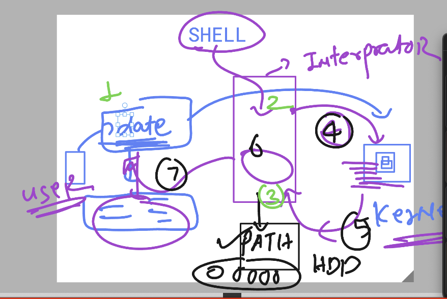
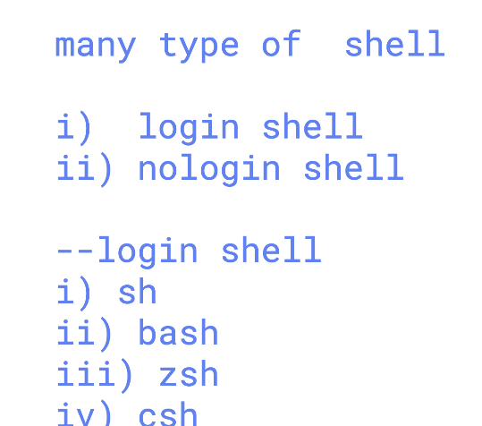
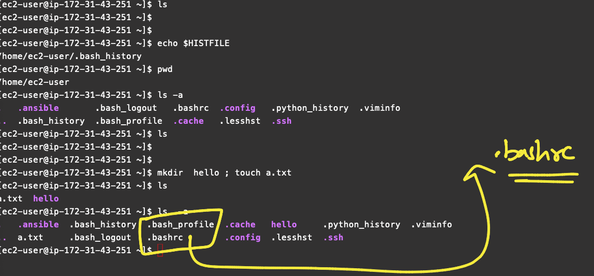

# linux_kernel_siemens_27thOct2025

### more info about os support 


### systemd as parent process of Linux based OS 

```
 pstree
systemd─┬─NetworkManager───2*[{NetworkManager}]
        ├─2*[agetty]
        ├─auditd─┬─sedispatch
        │        └─2*[{auditd}]
        ├─chronyd
        ├─crond
        ├─dbus-broker-lau───dbus-broker
        ├─irqbalance───{irqbalance}
        ├─polkitd───5*[{polkitd}]
        ├─rhsmcertd───{rhsmcertd}
        ├─rsyslogd───2*[{rsyslogd}]
        ├─sshd─┬─sshd───sshd───bash
        │      └─sshd───sshd───bash───sudo───bash───pstree
        ├─systemd───(sd-pam)
        ├─systemd-journal
        ├─systemd-logind
        ├─systemd-udevd
        └─tuned───3*[{tuned}]

```

### bootloader info 


## Understanding Shell in LInux 



### info about shell 



### shell avaialble shells 

```
 
[ec2-user@ip-172-31-43-251 ~]$ cat  /etc/shells 
/bin/sh
/bin/bash
/usr/bin/sh
/usr/bin/bash
[ec2-user@ip-172-31-43-251 ~]$ 


```

### checking current shell of user 

```
 echo $SHELL 
/bin/bash
[ec2-user@ip-172-31-43-251 ~]$ 

127  echo $SHELL 
  128  echo $HOME 
  129  echo $LANG
  130  echo $HISTSIZE
  131  echo $HISTFILE


```

### .bashrc and .bash_profile file 



### using source command to load .bashrc file 

```
[ec2-user@ip-172-31-43-251 ~]$ vim  .bashrc 
[ec2-user@ip-172-31-43-251 ~]$ 
[ec2-user@ip-172-31-43-251 ~]$ echo $HISTFILE
/home/ec2-user/.bash_history
[ec2-user@ip-172-31-43-251 ~]$ echo $HISTSIZE
1000
[ec2-user@ip-172-31-43-251 ~]$ source  ~/.bashrc 
[ec2-user@ip-172-31-43-251 ~]$ echo $HISTSIZE
20000
[ec2-user@ip-172-31-43-251 ~]$ echo $HISTFILE
/home/ec2-user/.ashu_data_history.txt

```

### setting variable with and without export 

## Note with export all the child process can access it 

```
[ec2-user@ip-172-31-43-251 ~]$ z=200
[ec2-user@ip-172-31-43-251 ~]$ 
[ec2-user@ip-172-31-43-251 ~]$ ps
    PID TTY          TIME CMD
   3423 pts/7    00:00:00 bash
   3733 pts/7    00:00:00 ps
[ec2-user@ip-172-31-43-251 ~]$ bash -c "echo $z"
200
[ec2-user@ip-172-31-43-251 ~]$ python
Python 3.9.21 (main, Feb 10 2025, 00:00:00) 
[GCC 11.5.0 20240719 (Red Hat 11.5.0-5)] on linux
Type "help", "copyright", "credits" or "license" for more information.
>>> import os
>>> print(os.getenv("z"))
None
>>> 
[ec2-user@ip-172-31-43-251 ~]$ export z=300
[ec2-user@ip-172-31-43-251 ~]$ bash -c "echo $z"
300
[ec2-user@ip-172-31-43-251 ~]$ 
[ec2-user@ip-172-31-43-251 ~]$ python
Python 3.9.21 (main, Feb 10 2025, 00:00:00) 
[GCC 11.5.0 20240719 (Red Hat 11.5.0-5)] on linux
Type "help", "copyright", "credits" or "license" for more information.
>>> import os
>>> print(os.getenv("z"))
300
>>> 

```