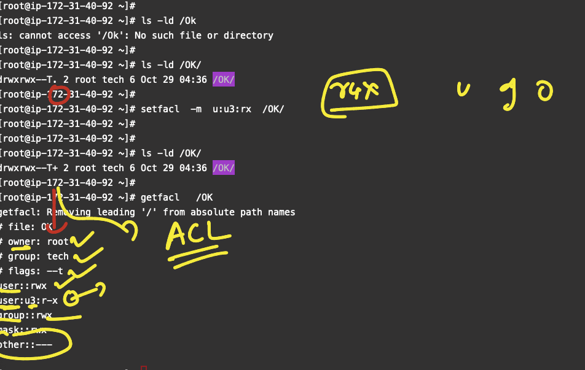
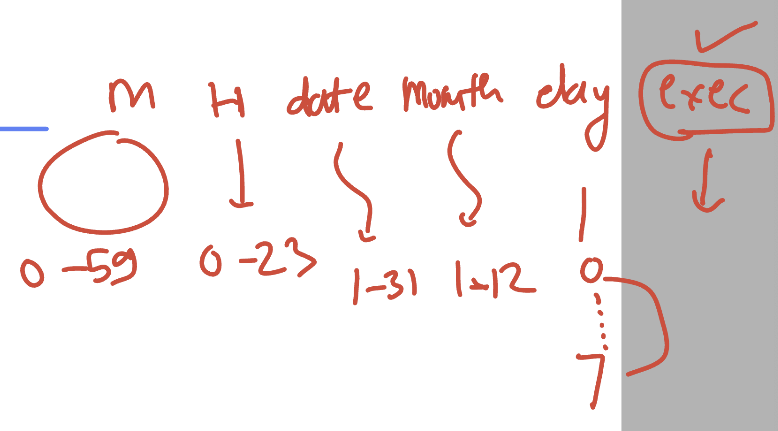
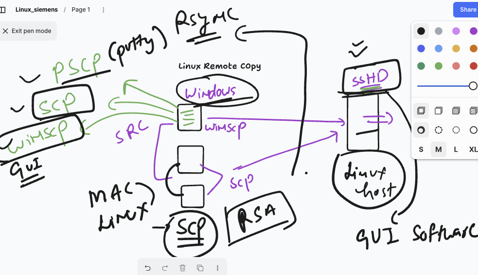
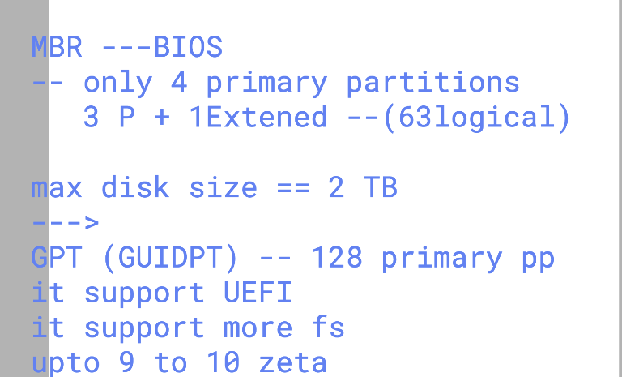
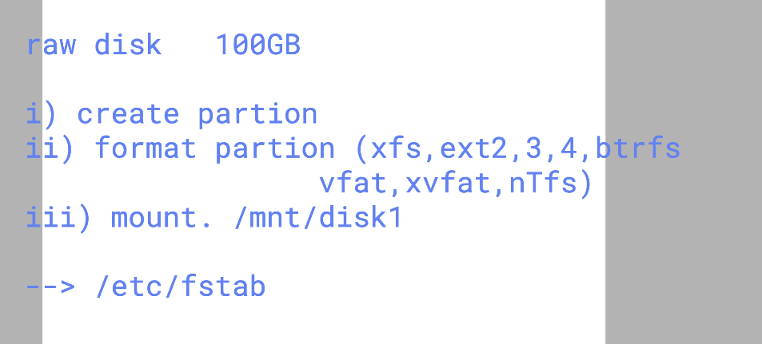
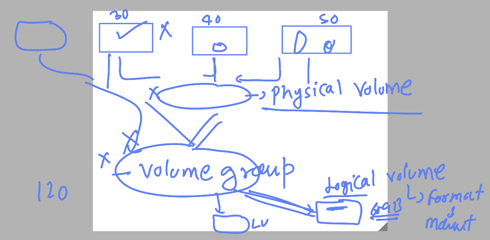

# linux_kernel_siemens_27thOct2025

### ACL 



### commands of ACL 

```
root@ip-172-31-40-92 ~]# ls -ld /OK/
drwxrwx--T+ 2 root tech 6 Oct 29 04:36 /OK/
[root@ip-172-31-40-92 ~]# 
[root@ip-172-31-40-92 ~]# setfacl  -m  g:manager:wx  /OK/ 
[root@ip-172-31-40-92 ~]# getfacl /OK/
getfacl: Removing leading '/' from absolute path names
# file: OK/
# owner: root
# group: tech
# flags: --t
user::rwx
user:u3:r-x
group::rwx
group:manager:-wx
mask::rwx
other::---


===>

setfacl -x u:u3  /bin/mkdir  

setfacl -b  /bin/mkdir  
```

### CronJOBS 



### status of crond 

```
 systemctl status crond
● crond.service - Command Scheduler
     Loaded: loaded (/usr/lib/systemd/system/crond.service; enabled; preset: enabled)
     Active: active (running) since Wed 2025-10-29 04:34:36 UTC; 1h 25min ago
   Main PID: 1165 (crond)
      Tasks: 2 (limit: 48572)
     Memory: 2.2M
        CPU: 1.240s
     CGroup: /system.slice/crond.service

```
### some crontab commands 

```
[root@ip-172-31-40-92 ~]# crontab  -l 
no crontab for root
[root@ip-172-31-40-92 ~]# crontab -u u3  -l 
no crontab for u3
[root@ip-172-31-40-92 ~]# 


```
### crontab file 

```
cat /etc/crontab 
SHELL=/bin/bash
PATH=/sbin:/bin:/usr/sbin:/usr/bin
MAILTO=root

# For details see man 4 crontabs

# Example of job definition:
# .---------------- minute (0 - 59)
# |  .------------- hour (0 - 23)
# |  |  .---------- day of month (1 - 31)
# |  |  |  .------- month (1 - 12) OR jan,feb,mar,apr ...
# |  |  |  |  .---- day of week (0 - 6) (Sunday=0 or 7) OR sun,mon,tue,wed,thu,fri,sat
# |  |  |  |  |
# *  *  *  *  * user-name  command to be executed

```


### remote copy 



### using scp 

```
scp  -i  Downloads/ashu-delvex.pem     a.py   ec2-user@13.201.121.49:/home/ec2-user/
a.py                                                                                                     100%  237     5.2KB/s   00:00    
 humanfirmware@darwin  ~  scp    a.py   test@13.201.121.49:/tmp/          
test@13.201.121.49: Permission denied (publickey,gssapi-keyex,gssapi-with-mic).
scp: Connection closed
 ✘ humanfirmware@darwin  ~  scp    a.py   test@13.201.121.49:/tmp/
test@13.201.121.49's password: 
a.py                                                 

```

### software installer 

```
  rpm  -q   vim 
   80  rpm  -q   date
   81  rpm  -q   httpd
   82  dnf install httpd -y &>/dev/null 
   83  rpm  -q   httpd
   84  rpm  -qi   httpd
   85  rpm  -ql   httpd
   86  rpm  -qc  httpd
   87  rpm  -ql   httpd
   88  history 
   89  rpm  -e   httpd
   90  dnf remove httpd 

```


### creating repo 

```
root@ip-172-31-40-92 yum.repos.d]# cd /etc/yum.repos.d/
[root@ip-172-31-40-92 yum.repos.d]# ls
el.repo  redhat-rhui-beta.repo.disabled  redhat-rhui-client-config.repo  redhat-rhui-eus.repo.disabled  redhat-rhui.repo
[root@ip-172-31-40-92 yum.repos.d]# 
[root@ip-172-31-40-92 yum.repos.d]# 

vim ashu.repo 

```

### SOme info about software package 

```
141  rpm -qf  `which date`
  142  rm -rf `which date`
  143  rpm -qf  `which date`
  144  busybox 
  145  dnf install busybox 
  146  date
  147  busybox  date 
  148  man busybox 
  149  dnf  whatprovides  */date
  150  dnf install coreutils
  151  date
  152  dnf reinstall coreutils
  153  date
  154  history 
  155  rpm -qf `which date`
  156  rm -rf `which cal`
  157  cal
  158  busybox  cal 
  159  cal
  160  dnf reinstall util-linux

```

## partition table in Disk space 



### more info 



### Gdisk to create first partition 

```
[root@ip-172-31-40-92 ~]# gdisk  /dev/xvdb 
GPT fdisk (gdisk) version 1.0.7

Partition table scan:
  MBR: not present
  BSD: not present
  APM: not present
  GPT: not present

Creating new GPT entries in memory.

Command (? for help): p
Disk /dev/xvdb: 20971520 sectors, 10.0 GiB
Sector size (logical/physical): 512/512 bytes
Disk identifier (GUID): AC66AAED-7ABF-4B12-9BBE-068415A28266
Partition table holds up to 128 entries
Main partition table begins at sector 2 and ends at sector 33
First usable sector is 34, last usable sector is 20971486
Partitions will be aligned on 2048-sector boundaries
Total free space is 20971453 sectors (10.0 GiB)

Number  Start (sector)    End (sector)  Size       Code  Name

Command (? for help): n
Partition number (1-128, default 1): 
First sector (34-20971486, default = 2048) or {+-}size{KMGTP}: 
Last sector (2048-20971486, default = 20971486) or {+-}size{KMGTP}: +2G
Current type is 8300 (Linux filesystem)
Hex code or GUID (L to show codes, Enter = 8300): 
Changed type of partition to 'Linux filesystem'

Command (? for help): p
Disk /dev/xvdb: 20971520 sectors, 10.0 GiB
Sector size (logical/physical): 512/512 bytes
Disk identifier (GUID): AC66AAED-7ABF-4B12-9BBE-068415A28266
Partition table holds up to 128 entries
Main partition table begins at sector 2 and ends at sector 33
First usable sector is 34, last usable sector is 20971486
Partitions will be aligned on 2048-sector boundaries
Total free space is 16777149 sectors (8.0 GiB)

Number  Start (sector)    End (sector)  Size       Code  Name
   1            2048         4196351   2.0 GiB     8300  Linux filesystem

Command (? for help): wq

Final checks complete. About to write GPT data. THIS WILL OVERWRITE EXISTING
PARTITIONS!!

Do you want to proceed? (Y/N): y
OK; writing new GUID partition table (GPT) to /dev/xvdb.
The operation has completed successfully.

```

### another demo 

```
root@ip-172-31-40-92 ~]# gdisk  /dev/xvdb 
GPT fdisk (gdisk) version 1.0.7

Partition table scan:
  MBR: protective
  BSD: not present
  APM: not present
  GPT: present

Found valid GPT with protective MBR; using GPT.

Command (? for help): p
Disk /dev/xvdb: 20971520 sectors, 10.0 GiB
Sector size (logical/physical): 512/512 bytes
Disk identifier (GUID): AC66AAED-7ABF-4B12-9BBE-068415A28266
Partition table holds up to 128 entries
Main partition table begins at sector 2 and ends at sector 33
First usable sector is 34, last usable sector is 20971486
Partitions will be aligned on 2048-sector boundaries
Total free space is 16777149 sectors (8.0 GiB)

Number  Start (sector)    End (sector)  Size       Code  Name
   1            2048         4196351   2.0 GiB     8300  Linux filesystem

Command (? for help): n
Partition number (2-128, default 2): 
First sector (34-20971486, default = 4196352) or {+-}size{KMGTP}: 
Last sector (4196352-20971486, default = 20971486) or {+-}size{KMGTP}: +3G
Current type is 8300 (Linux filesystem)
Hex code or GUID (L to show codes, Enter = 8300): 
Changed type of partition to 'Linux filesystem'

Command (? for help): p
Disk /dev/xvdb: 20971520 sectors, 10.0 GiB
Sector size (logical/physical): 512/512 bytes
Disk identifier (GUID): AC66AAED-7ABF-4B12-9BBE-068415A28266
Partition table holds up to 128 entries
Main partition table begins at sector 2 and ends at sector 33
First usable sector is 34, last usable sector is 20971486
Partitions will be aligned on 2048-sector boundaries
Total free space is 10485693 sectors (5.0 GiB)

Number  Start (sector)    End (sector)  Size       Code  Name
   1            2048         4196351   2.0 GiB     8300  Linux filesystem
   2         4196352        10487807   3.0 GiB     8300  Linux filesystem

Command (? for help): w 

Final checks complete. About to write GPT data. THIS WILL OVERWRITE EXISTING
PARTITIONS!!

Do you want to proceed? (Y/N): y
OK; writing new GUID partition table (GPT) to /dev/xvdb.
The operation has completed successfully.


```
### creating file system 

```
mkfs.xfs    /dev/xvdb1 
meta-data=/dev/xvdb1             isize=512    agcount=4, agsize=131072 blks
         =                       sectsz=512   attr=2, projid32bit=1
         =                       crc=1        finobt=1, sparse=1, rmapbt=0
         =                       reflink=1    bigtime=1 inobtcount=1 nrext64=0
data     =                       bsize=4096   blocks=524288, imaxpct=25
         =                       sunit=0      swidth=0 blks
naming   =version 2              bsize=4096   ascii-ci=0, ftype=1
log      =internal log           bsize=4096   blocks=16384, version=2
         =                       sectsz=512   sunit=0 blks, lazy-count=1
realtime =none                   extsz=4096   blocks=0, rtextents=0

```
### mounting 


```
[root@ip-172-31-40-92 ~]# mkdir  /mnt/ashudisk1
[root@ip-172-31-40-92 ~]# 
[root@ip-172-31-40-92 ~]# mount  /dev/xvdb1  /mnt/ashudisk1/
[root@ip-172-31-40-92 ~]# 

```

### showing mounted disks

```
df -hT
Filesystem     Type      Size  Used Avail Use% Mounted on
devtmpfs       devtmpfs  4.0M     0  4.0M   0% /dev
tmpfs          tmpfs     3.8G     0  3.8G   0% /dev/shm
tmpfs          tmpfs     1.5G   27M  1.5G   2% /run
/dev/xvda4     xfs        29G  5.7G   24G  20% /
/dev/xvda3     xfs       960M  599M  362M  63% /boot
/dev/xvda2     vfat      200M  7.1M  193M   4% /boot/efi
tmpfs          tmpfs     768M     0  768M   0% /run/user/1000
/dev/xvdb1     xfs       2.0G   47M  1.9G   3% /mnt/ashudisk1

```

### fstab 

```
[root@ip-172-31-40-92 ~]# cat /etc/fstab
UUID=b838f0f7-0240-46ea-bf53-c811361cbe43	/	xfs	defaults	0	0
UUID=27bfefa8-69e7-41ce-a184-c487d56cac49	/boot	xfs	defaults	0	0
UUID=7B77-95E7	/boot/efi	vfat	defaults,uid=0,gid=0,umask=077,shortname=winnt	0	2

UUID="632236a8-181c-409a-a0d0-be9e5270f4ff"    /mnt/okk      xfs  defaults 0  0
[root@ip-172-31-40-92 ~]# 

```
### LVM -- DeviceMapper



### creating pv

```
[root@ip-172-31-40-92 ~]# pvcreate   /dev/xvdb3 
  Physical volume "/dev/xvdb3" successfully created.
  Creating devices file /etc/lvm/devices/system.devices
[root@ip-172-31-40-92 ~]# pvs
  PV         VG Fmt  Attr PSize PFree
  /dev/xvdb3    lvm2 ---  4.00g 4.00g
[root@ip-172-31-40-92 ~]# pvdisplay 
  "/dev/xvdb3" is a new physical volume of "4.00 GiB"
  --- NEW Physical volume ---
  PV Name               /dev/xvdb3
  VG Name               
  PV Size               4.00 GiB
  Allocatable           NO
  PE Size               0   
  Total PE              0
  Free PE               0
  Allocated PE          0
  PV UUID               Wa7xpL-yqWr-AVjT-njnc-rf10-hELI-rOg4aA
   

```
### creating volume group 

```
[root@ip-172-31-40-92 ~]# vgcreate  ashu-vg  /dev/xvdb3 
  Volume group "ashu-vg" successfully created
[root@ip-172-31-40-92 ~]# 
[root@ip-172-31-40-92 ~]# 
[root@ip-172-31-40-92 ~]# vgs
  VG      #PV #LV #SN Attr   VSize  VFree 
  ashu-vg   1   0   0 wz--n- <4.00g <4.00g
[root@ip-172-31-40-92 ~]# 
[root@ip-172-31-40-92 ~]# 
[root@ip-172-31-40-92 ~]# vgdisplay 
  --- Volume group ---
  VG Name               ashu-vg
  System ID             
  Format                lvm2
  Metadata Areas        1
  Metadata Sequence No  1
  VG Access             read/write
  VG Status             resizable
  MAX LV                0


```
### creating LVM 

```
[root@ip-172-31-40-92 ~]# lvcreate  --name   ashu-data-docs  --size  3000M   ashu-vg  
  Logical volume "ashu-data-docs" created.
[root@ip-172-31-40-92 ~]# lvs
  LV             VG      Attr       LSize  Pool Origin Data%  Meta%  Move Log Cpy%Sync Convert
  ashu-data-docs ashu-vg -wi-a----- <2.93g                                                    
[root@ip-172-31-40-92 ~]# lvdisplay 
  --- Logical volume ---
  LV Path                /dev/ashu-vg/ashu-data-docs
  LV Name                ashu-data-docs
  VG Name                ashu-vg
  LV UUID                2fgLhw-lyiC-OlNX-bK8U-EFuI-rVXb-03arZU
  LV Write Access        read/write
  LV Creation host, time ip-172-31-40-92.ap-south-1.compute.internal, 2025-10-29 12:03:25 +0000
  LV Status              available
  # open                 0
  LV Size                <2.93 GiB
  Current LE             750
  Segments               1
  Allocation             inherit
  Read ahead sectors     auto
  - currently set to     8192
  Block device           253:0


```
