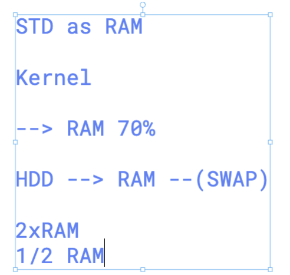
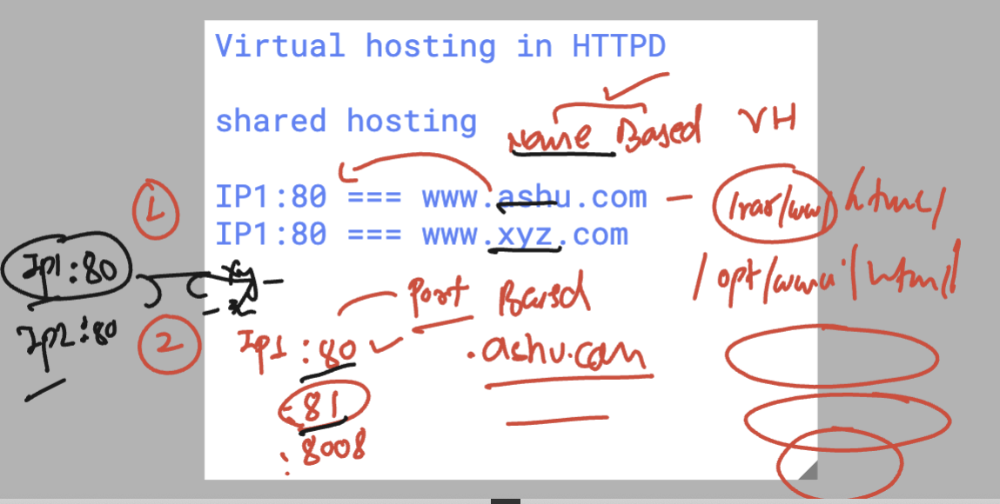

# linux_kernel_siemens_27thOct2025


### creating LVM 

```
[root@ip-172-31-42-139 ~]# pvcreate   /dev/xvdb1   /dev/xvdc1 
  Physical volume "/dev/xvdb1" successfully created.
  Physical volume "/dev/xvdc1" successfully created.
  Creating devices file /etc/lvm/devices/system.devices
[root@ip-172-31-42-139 ~]# 


====> VG Create


[root@ip-172-31-42-139 ~]# vgcreate   ashu-vg-new   /dev/xvdb1   /dev/xvdc1  
  Volume group "ashu-vg-new" successfully created
[root@ip-172-31-42-139 ~]# 
[root@ip-172-31-42-139 ~]# 
[root@ip-172-31-42-139 ~]# 
[root@ip-172-31-42-139 ~]# vgs
  VG          #PV #LV #SN Attr   VSize  VFree 
  ashu-vg-new   2   0   0 wz--n- 19.99g 19.99g
[root@ip-172-31-42-139 ~]# vgdisplay 
  --- Volume group ---
  VG Name               ashu-vg-new
  System ID             
  Format                lvm2
  Metadata Areas        2
  Metadata Sequence No  1
  VG Access             read/write
  VG Status             resizable
  MAX LV                0
  Cur LV                0
  Open LV               0
  Max PV                0
  Cur PV                2
  Act PV                2
  VG Size               19.99 GiB
  PE Size               4.00 MiB
  Total PE              5118
  Alloc PE / Size       0 / 0   


===> LV create 

[root@ip-172-31-42-139 ~]# lvcreate    --name mywebsite  --size  7G        ashu-vg-new  
  Logical volume "mywebsite" created.
[root@ip-172-31-42-139 ~]# lvs
  LV        VG          Attr       LSize Pool Origin Data%  Meta%  Move Log Cpy%Sync Convert
  mywebsite ashu-vg-new -wi-a----- 7.00g                                                    
[root@ip-172-31-42-139 ~]# lvdisplay 
  --- Logical volume ---
  LV Path                /dev/ashu-vg-new/mywebsite
  LV Name                mywebsite
  VG Name                ashu-vg-new
  LV UUID                iynNLu-4DyS-oeB8-pfAc-rila-UUCx-YWsvbo
  LV Write Access        read/write
  LV Creation host, time ip-172-31-42-139.ap-south-1.compute.internal, 2025-10-30 05:01:37 +0000
  LV Status              available
  # open                 0
  LV Size                7.00 GiB
  Current LE             1792
  Segments               1
  Allocation             inherit
  Read ahead sectors     auto
  - currently set to     8192
  Block device           253:0
   

===> Format and Mount 

 mkfs.xfs    /dev/ashu-vg-new/mywebsite
   33  rpm -q httpd
   34  mount  /dev/ashu-vg-new/mywebsite  /var/www/html/


```

### copy webcode to  /var/www/html 

```
cd /tmp/
[root@ip-172-31-42-139 tmp]# git clone https://github.com/schoolofdevops/html-sample-app.git
Cloning into 'html-sample-app'...
remote: Enumerating objects: 74, done.
remote: Counting objects: 100% (3/3), done.
remote: Compressing objects: 100% (3/3), done.
remote: Total 74 (delta 0), reused 0 (delta 0), pack-reused 71 (from 1)
Receiving objects: 100% (74/74), 1.38 MiB | 3.57 MiB/s, done.
Resolving deltas: 100% (5/5), done.
[root@ip-172-31-42-139 tmp]# ls
html-sample-app
systemd-private-d4a9f161545e4784b47e319b183bfee4-chronyd.service-ZxuX9o
systemd-private-d4a9f161545e4784b47e319b183bfee4-dbus-broker.service-bfrGLx
systemd-private-d4a9f161545e4784b47e319b183bfee4-irqbalance.service-lL6Ym7
systemd-private-d4a9f161545e4784b47e319b183bfee4-kdump.service-tCmuXa
systemd-private-d4a9f161545e4784b47e319b183bfee4-systemd-logind.service-N1QCaj
[root@ip-172-31-42-139 tmp]# 
[root@ip-172-31-42-139 tmp]# 
[root@ip-172-31-42-139 tmp]# cp -rf html-sample-app/*  /var/www/html/
[root@ip-172-31-42-139 tmp]# 
[root@ip-172-31-42-139 tmp]# ls /var/www/html/
assets  elements.html  generic.html  html5up-phantom.zip  images  index.html  LICENSE.txt  README.txt
[root@ip-172-31-42-139 tmp]# 


```

### lvm extend

```
111  lvextend  --size  +5G  /dev/ashu-vg-new/mywebsite 
  112  lvs
  113  df -h
  114  fallocate -l 8G  /var/www/html/ashu.txt 
  115  history 
  116  xfs_growfs   /dev/ashu-vg-new/mywebsite 

```

### SWAP / PRimary memory concept 



```
[root@ip-172-31-6-186 ~]# free 
               total        used        free      shared  buff/cache   available
Mem:         3740112      480328     2851048       18904      649696     3259784
Swap:              0           0           0
[root@ip-172-31-6-186 ~]# 
[root@ip-172-31-6-186 ~]# 
[root@ip-172-31-6-186 ~]# free  -m
               total        used        free      shared  buff/cache   available
Mem:            3652         469        2784          18         634        3183
Swap:              0           0           0
[root@ip-172-31-6-186 ~]# free  -h
               total        used        free      shared  buff/cache   available
Mem:           3.6Gi       469Mi       2.7Gi        18Mi       634Mi       3.1Gi
Swap:             0B          0B          0B


```
### creating swap from LVM 

```
[root@ip-172-31-42-139 ~]# free  -h
               total        used        free      shared  buff/cache   available
Mem:           7.5Gi       532Mi       6.5Gi        18Mi       733Mi       7.0Gi
Swap:             0B          0B          0B
[root@ip-172-31-42-139 ~]# 
[root@ip-172-31-42-139 ~]# 
[root@ip-172-31-42-139 ~]# vgs
  VG          #PV #LV #SN Attr   VSize  VFree
  ashu-vg-new   2   1   0 wz--n- 19.99g 7.99g
[root@ip-172-31-42-139 ~]# 
[root@ip-172-31-42-139 ~]# 
[root@ip-172-31-42-139 ~]# lvcreate --size 4G --name ashu-swap1  ashu-vg-new  
  Logical volume "ashu-swap1" created.
[root@ip-172-31-42-139 ~]# 
[root@ip-172-31-42-139 ~]# 
[root@ip-172-31-42-139 ~]# lvs
  LV         VG          Attr       LSize  Pool Origin Data%  Meta%  Move Log Cpy%Sync Convert
  ashu-swap1 ashu-vg-new -wi-a-----  4.00g                                                    
  mywebsite  ashu-vg-new -wi-ao---- 12.00g                                                    
[root@ip-172-31-42-139 ~]# lvdisplay 
  --- Logical volume ---
  LV Path                /dev/ashu-vg-new/mywebsite
  LV Name                mywebsite
  VG Name                ashu-vg-new
  LV UUID                iynNLu-4DyS-oeB8-pfAc-rila-UUCx-YWsvbo
  LV Write Access        read/write
  LV Creation host, time ip-172-31-42-139.ap-south-1.compute.internal, 2025-10-30 05:01:37 +0000
  LV Status              available
  # open                 1
  LV Size                12.00 GiB
  Current LE             3072
  Segments               2
  Allocation             inherit
  Read ahead sectors     auto
  - currently set to     8192
  Block device           253:0
   
  --- Logical volume ---
  LV Path                /dev/ashu-vg-new/ashu-swap1
  LV Name                ashu-swap1
  VG Name                ashu-vg-new
  LV UUID                fVtKSI-KIRi-fW0l-7IpX-XfgL-QEpH-JLQmNF
  LV Write Access        read/write
  LV Creation host, time ip-172-31-42-139.ap-south-1.compute.internal, 2025-10-30 06:55:51 +0000
  LV Status              available
  # open                 0
  LV Size                4.00 GiB
  Current LE             1024
  Segments               1
  Allocation             inherit
  Read ahead sectors     auto
  - currently set to     8192
  Block device           253:1


===> swap 

 mkswap  /dev/ashu-vg-new/ashu-swap1  
Setting up swapspace version 1, size = 4 GiB (4294963200 bytes)
no label, UUID=ecbeff6b-67cb-41d9-98bd-7d2b83430da9


==

swapon   /dev/ashu-vg-new/ashu-swap1 
[root@ip-172-31-42-139 ~]# 
[root@ip-172-31-42-139 ~]# free  -h
               total        used        free      shared  buff/cache   available
Mem:           7.5Gi       536Mi       6.5Gi        18Mi       734Mi       7.0Gi
Swap:          4.0Gi          0B       4.0Gi

===>

swapoff    /dev/ashu-vg-new/ashu-swap1 
[root@ip-172-31-42-139 ~]# free  -h
               total        used        free      shared  buff/cache   available
Mem:           7.5Gi       534Mi       6.5Gi        18Mi       734Mi       7.0Gi
Swap:             0B          0B          0B

```

### more swap commands 

```
root@ip-172-31-42-139 ~]# blkid /dev/ashu-vg-new/ashu-swap1 
/dev/ashu-vg-new/ashu-swap1: UUID="ecbeff6b-67cb-41d9-98bd-7d2b83430da9" TYPE="swap"
[root@ip-172-31-42-139 ~]# 
[root@ip-172-31-42-139 ~]# 
[root@ip-172-31-42-139 ~]# blkid   | grep swap 
/dev/mapper/ashu--vg--new-ashu--swap1: UUID="ecbeff6b-67cb-41d9-98bd-7d2b83430da9" TYPE="swap"
[root@ip-172-31-42-139 ~]# cat /etc/fstab 
UUID=b838f0f7-0240-46ea-bf53-c811361cbe43	/	xfs	defaults	0	0
UUID=27bfefa8-69e7-41ce-a184-c487d56cac49	/boot	xfs	defaults	0	0
UUID=7B77-95E7	/boot/efi	vfat	defaults,uid=0,gid=0,umask=077,shortname=winnt	0	2
UUID="ecbeff6b-67cb-41d9-98bd-7d2b83430da9"  swap    swap  defaults 0 0 
[root@ip-172-31-42-139 ~]# 
[root@ip-172-31-42-139 ~]# free -h
               total        used        free      shared  buff/cache   available
Mem:           7.5Gi       535Mi       6.5Gi        18Mi       735Mi       7.0Gi
Swap:          4.0Gi          0B       4.0Gi
[root@ip-172-31-42-139 ~]# swapoff -a
[root@ip-172-31-42-139 ~]# free -h
               total        used        free      shared  buff/cache   available
Mem:           7.5Gi       533Mi       6.5Gi        18Mi       734Mi       7.0Gi
Swap:             0B          0B          0B
[root@ip-172-31-42-139 ~]# swapon -a
[root@ip-172-31-42-139 ~]# free -h
               total        used        free      shared  buff/cache   available
Mem:           7.5Gi       535Mi       6.5Gi        18Mi       734Mi       7.0Gi
Swap:          4.0Gi          0B       4.0Gi

```

## apache httpd VHOST 



### creating vhost conf file 

```
[root@ip-172-31-42-139 www]# cd /etc/httpd/
[root@ip-172-31-42-139 httpd]# ls
conf  conf.d  conf.modules.d  logs  modules  run  state
[root@ip-172-31-42-139 httpd]# 
[root@ip-172-31-42-139 httpd]# 
[root@ip-172-31-42-139 httpd]# cd conf.d/
[root@ip-172-31-42-139 conf.d]# ls
autoindex.conf  README  userdir.conf  welcome.conf
[root@ip-172-31-42-139 conf.d]# touch   ashu.conf    jack.conf 
[root@ip-172-31-42-139 conf.d]# ls
ashu.conf  autoindex.conf  jack.conf  README  userdir.conf  welcome.conf
[root@ip-172-31-42-139 conf.d]# 


===>ashu.conf 

[root@ip-172-31-42-139 conf.d]# cat ashu.conf 
<virtualhost  172.31.42.139:80>
	servername  www.ashu.com 
	documentroot  /var/www/ashu/
</virtualhost>

===>
httpd -t
systemctl reload httpd

===
ot@ip-172-31-42-139 ~]# hostname -i
172.31.42.139
[root@ip-172-31-42-139 ~]# vim  /etc/hosts 
[root@ip-172-31-42-139 ~]# cat  /etc/hosts 
127.0.0.1   localhost localhost.localdomain localhost4 localhost4.localdomain4
::1         localhost localhost.localdomain localhost6 localhost6.localdomain6


172.31.42.139    www.ashu.com
172.31.42.139    www.jack.com
[root@ip-172-31-42-139 ~]# 
[root@ip-172-31-42-139 ~]# 
[root@ip-172-31-42-139 ~]# 
[root@ip-172-31-42-139 ~]# curl http://www.ashu.com
Hello this is ashutoshh
[root@ip-172-31-42-139 ~]# curl http://www.jack.com
Hello this is jack
[root@ip-172-31-42-139 ~]# 


```

### logs for custom apps 

```
cat ashu.conf 
<virtualhost  172.31.42.139:80>
	servername  www.ashu.com 
	documentroot  /var/www/ashu/
        CustomLog  /var/log/httpd/ashu/access.log  combined  
        ErrorLog  /var/log/httpd/ashu/error.log 
</virtualhost>

```
