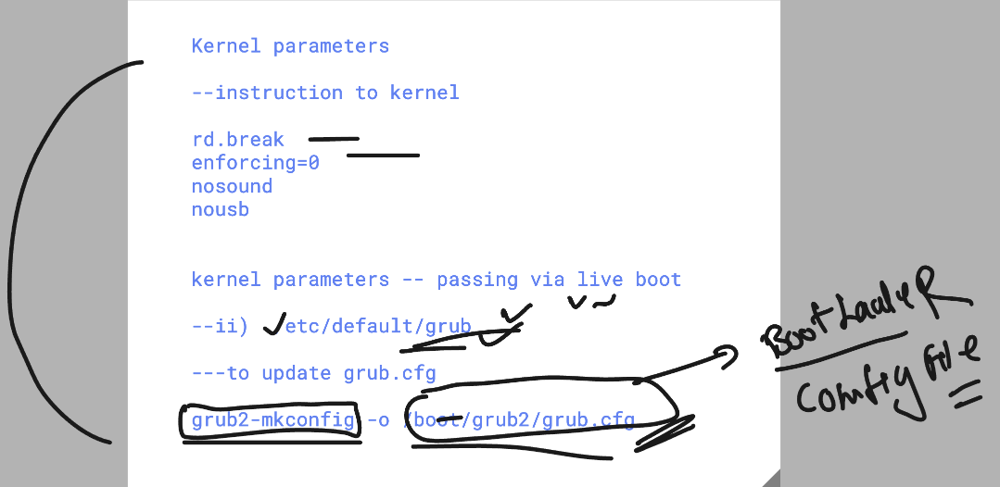
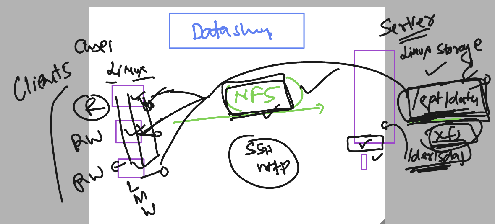
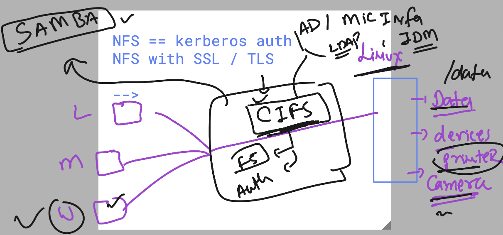
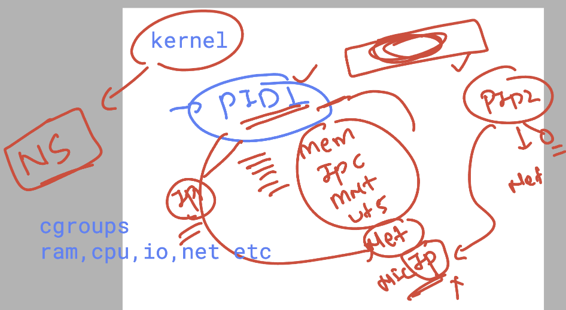

# linux_kernel_siemens_27thOct2025

### Boot loader config file 




### few grub related commands 

```
595  cat  /etc/default/grub 
  596  grub2-mkconfig  
  597  grub2-mkconfig    | grep -i nosound 
  598  vim /boot/grub2/grub.cfg 
  599  grub2-mkconfig    


```

### Understanding NFS. 



### configuring NFS server side 

```
root@ip-172-31-14-249 ~]# mkdir  -p /data/{docs,files,vidoes}
[root@ip-172-31-14-249 ~]# 
[root@ip-172-31-14-249 ~]# touch  /data/docs/helloo{1..50}.txt
[root@ip-172-31-14-249 ~]# 
[root@ip-172-31-14-249 ~]# ls /data/docs/
helloo10.txt  helloo15.txt  helloo1.txt   helloo24.txt  helloo29.txt  helloo33.txt  helloo38.txt  helloo42.txt  helloo47.txt  helloo5.txt
helloo11.txt  helloo16.txt  helloo20.txt  helloo25.txt  helloo2.txt   helloo34.txt  helloo39.txt  helloo43.txt  helloo48.txt  helloo6.txt
helloo12.txt  helloo17.txt  helloo21.txt  helloo26.txt  helloo30.txt  helloo35.txt  helloo3.txt   helloo44.txt  helloo49.txt  helloo7.txt
helloo13.txt  helloo18.txt  helloo22.txt  helloo27.txt  helloo31.txt  helloo36.txt  helloo40.txt  helloo45.txt  helloo4.txt   helloo8.txt
helloo14.txt  helloo19.txt  helloo23.txt  helloo28.txt  helloo32.txt  helloo37.txt  helloo41.txt  helloo46.txt  helloo50.txt  helloo9.txt
[root@ip-172-31-14-249 ~]# 


===
dnf install nfs-utils 

### configure to share data 

[root@ip-172-31-14-249 ~]# cat  /etc/exports
/data/docs    *(ro)
[root@ip-172-31-14-249 ~]# 
[root@ip-172-31-14-249 ~]# 
[root@ip-172-31-14-249 ~]# ls -ld /data/
drwxr-xr-x. 5 root root 45 Oct 31 05:46 /data/
[root@ip-172-31-14-249 ~]# ls -ld /data/docs/
drwxr-xr-x. 2 root root 4096 Oct 31 05:47 /data/docs/
[root@ip-172-31-14-249 ~]# ls -ldZ  /data/docs/
drwxr-xr-x. 2 root root unconfined_u:object_r:default_t:s0 4096 Oct 31 05:47 /data/docs/
[root@ip-172-31-14-249 ~]# setenforce 0
[root@ip-172-31-14-249 ~]# 


```
### nfs-server status

```
30  systemctl start nfs-server
   31  systemctl status nfs-server


===>

exportfs  -v
/data/vidoes  	172.31.9.29(sync,wdelay,hide,no_subtree_check,sec=sys,ro,secure,root_squash,no_all_squash)
/data/docs    	<world>(sync,wdelay,hide,no_subtree_check,sec=sys,ro,secure,root_squash,no_all_squash)
[root@ip-172-31-14-249 ~]# 


```

### nfs CLient side 

```
dnf install nfs-utils 

# from client machine checking nfs-server connection 

showmount   -e   172.31.14.249 
Export list for 172.31.14.249:
/data/docs   *
/data/vidoes 172.31.9.29
[root@ip-172-31-14-249 ~]# 

====>


===>

[root@ip-172-31-42-139 ~]# showmount   -e   172.31.14.249 
Export list for 172.31.14.249:
/data/docs   *
/data/vidoes 172.31.9.29
[root@ip-172-31-42-139 ~]# 
[root@ip-172-31-42-139 ~]# 
[root@ip-172-31-42-139 ~]# mkdir /mnt/ashu
[root@ip-172-31-42-139 ~]# 
[root@ip-172-31-42-139 ~]# mount    172.31.14.249:/data/docs  /mnt/ashu/
[root@ip-172-31-42-139 ~]# df 
Filesystem                          1K-blocks    Used Available Use% Mounted on
devtmpfs                                 4096       0      4096   0% /dev
tmpfs                                 3931364       0   3931364   0% /dev/shm
tmpfs                                 1572548   17020   1555528   2% /run
/dev/xvda4                          103536620 2807688 100728932   3% /
/dev/xvda3                             983040  188192    794848  20% /boot
/dev/xvda2                             204580    7216    197364   4% /boot/efi
/dev/mapper/ashu--vg--new-mywebsite  12517376  122772  12394604   1% /var/www/html
tmpfs                                  786272       0    786272   0% /run/user/1000
172.31.14.249:/data/docs             30136320 2136064  28000256   8% /mnt/ashu
[root@ip-172-31-42-139 ~]# df -hT
Filesystem                          Type      Size  Used Avail Use% Mounted on
devtmpfs                            devtmpfs  4.0M     0  4.0M   0% /dev
tmpfs                               tmpfs     3.8G     0  3.8G   0% /dev/shm
tmpfs                               tmpfs     1.5G   17M  1.5G   2% /run
/dev/xvda4                          xfs        99G  2.7G   97G   3% /
/dev/xvda3                          xfs       960M  184M  777M  20% /boot
/dev/xvda2                          vfat      200M  7.1M  193M   4% /boot/efi
/dev/mapper/ashu--vg--new-mywebsite xfs        12G  120M   12G   1% /var/www/html
tmpfs                               tmpfs     768M     0  768M   0% /run/user/1000
172.31.14.249:/data/docs            nfs4       29G  2.1G   27G   8% /mnt/ashu
[root@ip-172-31-42-139 ~]# 
[root@ip-172-31-42-139 ~]# 
[root@ip-172-31-42-139 ~]# 
[root@ip-172-31-42-139 ~]# 
[root@ip-172-31-42-139 ~]# 
[root@ip-172-31-42-139 ~]# ls /mnt/ashu/
helloo10.txt  helloo15.txt  helloo1.txt   helloo24.txt  helloo29.txt  helloo33.txt  helloo38.txt  helloo42.txt  helloo47.txt  helloo5.txt
helloo11.txt  helloo16.txt  helloo20.txt  helloo25.txt  helloo2.txt   helloo34.txt  helloo39.txt  helloo43.txt  helloo48.txt  helloo6.txt
helloo12.txt  helloo17.txt  helloo21.txt  helloo26.


```

## in client machine /etc/fstab entry 

```

172.31.14.249:/data/docs  /mnt/ashu/    nfs4    _netdev    0   0
```

## CIFS details 




### Installing samba server 

```
dnf install samba 

### configure locaiton 

root@ip-172-31-42-139 ~]# cd /etc/samba/
[root@ip-172-31-42-139 samba]# ls
lmhosts  smb.conf  smb.conf.backup  smb.conf.backup1  smb.conf.example
[root@ip-172-31-42-139 samba]# 
[root@ip-172-31-42-139 samba]# 
[root@ip-172-31-42-139 samba]# 
[root@ip-172-31-42-139 samba]# mkdir  -p  /opt/ashu-data/docs 
[root@ip-172-31-42-139 samba]# 
[root@ip-172-31-42-139 samba]# 
[root@ip-172-31-42-139 samba]# chmod  777 /opt/ashu-data/docs/
[root@ip-172-31-42-139 samba]# 
[root@ip-172-31-42-139 samba]# 
[root@ip-172-31-42-139 samba]# restorecon  /opt/ashu-data/docs/
[root@ip-172-31-42-139 samba]# 


```
### confdigure samba 

```
vim /etc/samba/smb.conf 

[ashudata-share]

path = /opt/ashu-data/docs/
read only = no
browsable = yes
writable = yes
guest ok = no
valid users =  ashunew

```

### creating user 

```
useradd  -s /sbin/nologin   ashunew 

smbpasswd -a  ashunew  
New SMB password:
Retype new SMB password:
Added user ashunew.


```
## Kernel some info 



