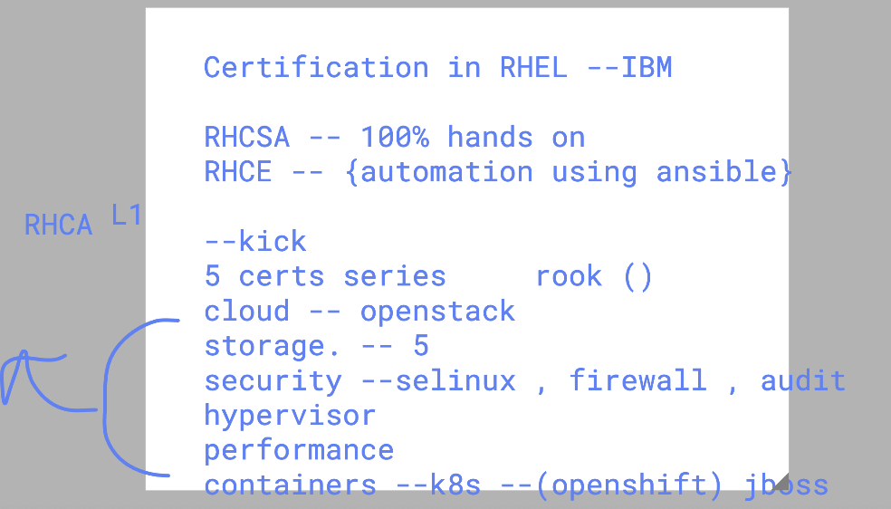
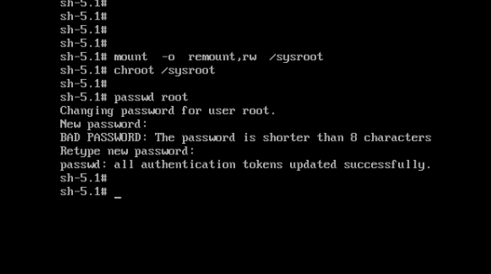
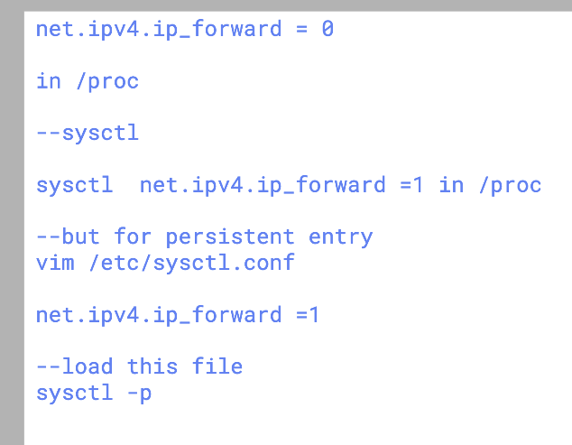

# linux_kernel_siemens_27thOct2025

## Certifications details




### checking for emergency mode troubleshooting and fixing selinux type 


### /sysroot mount 



### fixing selinux type 


### making grub.cfg updated with kernel parament persistenly ready 

```

cat  /etc/default/grub 
GRUB_CMDLINE_LINUX="console=tty0 console=ttyS0,115200n8 net.ifnames=0 nvme_core.io_timeout=4294967295 nosound"
GRUB_TIMEOUT=0
GRUB_ENABLE_BLSCFG=true
GRUB_DEFAULT=saved
[root@ip-172-31-42-139 ~]# cd /boot/grub2/
[root@ip-172-31-42-139 grub2]# ls
fonts  grub.cfg  grubenv  i386-pc
[root@ip-172-31-42-139 grub2]# 
[root@ip-172-31-42-139 grub2]# 
[root@ip-172-31-42-139 grub2]# 
[root@ip-172-31-42-139 grub2]# grub2-mkconfig  >/boot/grub2/grub.cfg  


```
### currently booted kernel parameters list

```
cat /proc/cmdline 
BOOT_IMAGE=(hd0,gpt3)/vmlinuz-5.14.0-570.22.1.el9_6.x86_64 root=UUID=b838f0f7-0240-46ea-bf53-c811361cbe43 console=tty0 console=ttyS0,115200n8 net.ifnames=0 nvme_core.io_timeout=4294967295 crashkernel=1G-4G:192M,4G-64G:256M,64G-:512M
[root@ip-172-31-42-139 grub2]# 


```
### checking with renice command to set priority values

```
[root@ip-172-31-42-139 ~]# dd if=/dev/zero of=/dev/null &
[1] 3356
[root@ip-172-31-42-139 ~]# jobs
[1]+  Running                 dd if=/dev/zero of=/dev/null &
[root@ip-172-31-42-139 ~]# dd if=/dev/zero of=/dev/null &
[2] 3411
[root@ip-172-31-42-139 ~]# 
[root@ip-172-31-42-139 ~]# jobs
[1]-  Running                 dd if=/dev/zero of=/dev/null &
[2]+  Running                 dd if=/dev/zero of=/dev/null &
[root@ip-172-31-42-139 ~]# ps -eo pid,ni,pri,cmd | grep dd
      2   0  19 [kthreadd]
   3356   0  19 dd if=/dev/zero of=/dev/null
   3411   0  19 dd if=/dev/zero of=/dev/null
   3527   0  19 grep --color=auto dd
[root@ip-172-31-42-139 ~]# renice -n -10 -p 3356 
3356 (process ID) old priority 0, new priority -10
[root@ip-172-31-42-139 ~]# ps -eo pid,ni,pri,cmd | grep dd
      2   0  19 [kthreadd]
   3356 -10  29 dd if=/dev/zero of=/dev/null
   3411   0  19 dd if=/dev/zero of=/dev/null
   3722   0  19 grep --color=auto dd

```

### listing loaded kernel module

```
[root@ip-172-31-42-139 ~]# lsmod   | wc -l 
52
[root@ip-172-31-42-139 ~]# lsmod   | grep xfs
xfs                  2686976  3
libcrc32c              12288  4 nf_conntrack,nf_nat,nf_tables,xfs
[root@ip-172-31-42-139 ~]# lsmod   | grep  dm
dm_snapshot            69632  3
dm_bufio               61440  1 dm_snapshot
dm_mirror              28672  0
dm_region_hash         28672  1 dm_mirror
dm_log                 24576  2 dm_region_hash,dm_mirror
dm_mod                245760  21 dm_log,dm_snapshot,dm_mirror,dm_bufio
[root@ip-172-31-42-139 ~]# lsmod   | grep  dev
[root@ip-172-31-42-139 ~]# 

```
### more info 

```
 794  history 
[root@ip-172-31-42-139 httpd]# lsmod  | grep xfs
xfs                  2686976  3
libcrc32c              12288  4 nf_conntrack,nf_nat,nf_tables,xfs
[root@ip-172-31-42-139 httpd]# mod
modinfo             modprobe            modulemd-validator  
[root@ip-172-31-42-139 httpd]# modinfo xfs
filename:       /lib/modules/5.14.0-570.22.1.el9_6.x86_64/kernel/fs/xfs/xfs.ko.xz
license:        GPL
description:    SGI XFS with ACLs, security attributes, scrub, quota, no debug enabled
author:         Silicon Graphics, Inc.
alias:          fs-xfs
rhelversion:    9.6

```
### module loading 

```
[root@ip-172-31-42-139 httpd]# lsmod  | grep loop 
[root@ip-172-31-42-139 httpd]# modprobe   loop 
[root@ip-172-31-42-139 httpd]# lsmod  | grep loop 
loop                   40960  0
[root@ip-172-31-42-139 httpd]# modinfo  loop 
filename:       /lib/modules/5.14.0-570.22.1.el9_6.x86_64/kernel/drivers/block/loop.ko.xz
alias:          devname:loop-control
alias:          char-major-10-237
alias:          block-major-7-*
license:        GPL
description:    Loopback device support
rhelversion:    9.6
srcversion:     BA928A39F2DA87FA12B9073


```

### sysctl 

### checking few details 

```
sysctl  -a   |  grep ipv4   | grep -i forward
net.ipv4.conf.all.bc_forwarding = 0
net.ipv4.conf.all.forwarding = 0
net.ipv4.conf.all.mc_forwarding = 0
net.ipv4.conf.default.bc_forwarding = 0
net.ipv4.conf.default.forwarding = 0
net.ipv4.conf.default.mc_forwarding = 0
net.ipv4.conf.eth0.bc_forwarding = 0
net.ipv4.conf.eth0.forwarding = 0
net.ipv4.conf.eth0.mc_forwarding = 0
net.ipv4.conf.lo.bc_forwarding = 0
net.ipv4.conf.lo.forwarding = 0
net.ipv4.conf.lo.mc_forwarding = 0
net.ipv4.ip_forward = 0
net.ipv4.ip_forward_update_priority = 1
net.ipv4.ip_forward_use_pmtu = 0
[root@ashutoshh ~]# 


###--
sysctl  -a   |  grep swap 
vm.swappiness = 30
[root@ashutoshh ~]# sysctl  -a   |  grep file 
fs.file-max = 9223372036854775807
fs.file-nr = 1376	0	9223372036854775807
fs.xfs.filestream_centisecs = 3000

```
### updating packet forwarding 

```
[root@ashutoshh ~]#   sysctl   net.ipv4.ip_forward 
net.ipv4.ip_forward = 0
[root@ashutoshh ~]#   sysctl   net.ipv4.ip_forward=1 
net.ipv4.ip_forward = 1
[root@ashutoshh ~]# sysctl  -a   |  grep ipv4   | grep -i forward
net.ipv4.conf.all.bc_forwarding = 0
net.ipv4.conf.all.forwarding = 1
net.ipv4.conf.all.mc_forwarding = 0
net.ipv4.conf.default.bc_forwarding = 0
net.ipv4.conf.default.forwarding = 1
net.ipv4.conf.default.mc_forwarding = 0
net.ipv4.conf.eth0.bc_forwarding = 0
net.ipv4.conf.eth0.forwarding = 1
net.ipv4.conf.eth0.mc_forwarding = 0
net.ipv4.conf.lo.bc_forwarding = 0
net.ipv4.conf.lo.forwarding = 1
net.ipv4.conf.lo.mc_forwarding = 0
net.ipv4.ip_forward = 1
net.ipv4.ip_forward_update_priority = 1

```
### checking on /proc 

```
[root@ashutoshh ~]# cat  /proc/sys/net/ipv4/ip_forward
1
[root@ashutoshh ~]# 
[root@ashutoshh ~]# 
[root@ashutoshh ~]# 
[root@ashutoshh ~]#   sysctl   net.ipv4.ip_forward=0
net.ipv4.ip_forward = 0
[root@ashutoshh ~]# 
[root@ashutoshh ~]# 
[root@ashutoshh ~]# cat  /proc/sys/net/ipv4/ip_forward
0
[root@ashutoshh ~]#   sysctl   net.ipv4.ip_forward=1
net.ipv4.ip_forward = 1
[root@ashutoshh ~]# 
[root@ashutoshh ~]# 
[root@ashutoshh ~]# cat  /proc/sys/net/ipv4/ip_forward
1
[root@ashutoshh ~]# 

```
### enable network packet forwarding persistenly in your machine 



