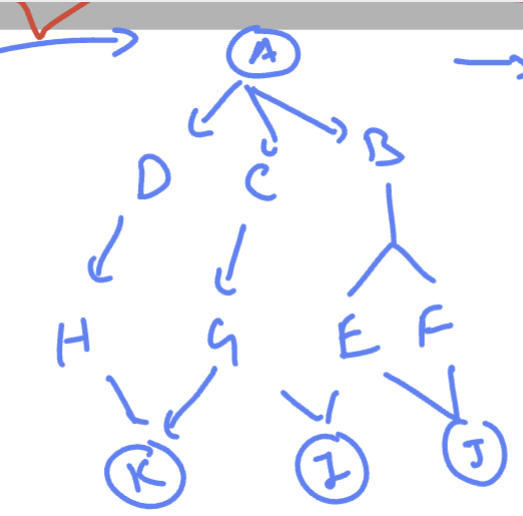

### creating directory structure 



### solution 

```
[test@ip-172-31-43-251 ~]$ mkdir  -p   ashuA/{b/{e/{j,i},f/j},c/g/k,d/h/k}
[test@ip-172-31-43-251 ~]$ tree  ashuA/
ashuA/
├── b
│   ├── e
│   │   ├── i
│   │   └── j
│   └── f
│       └── j
├── c
│   └── g
│       └── k
└── d
    └── h
        └── k

12 directories, 0 files

```